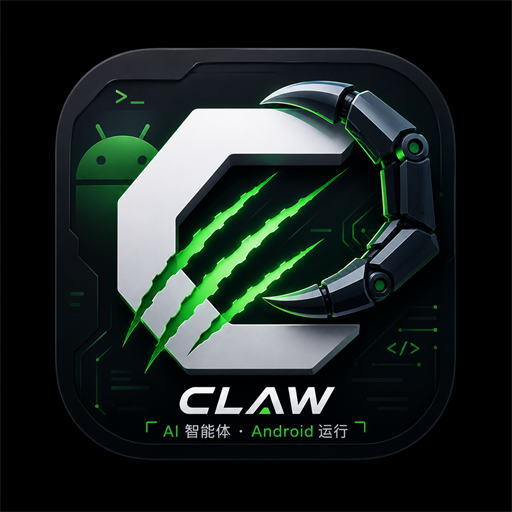
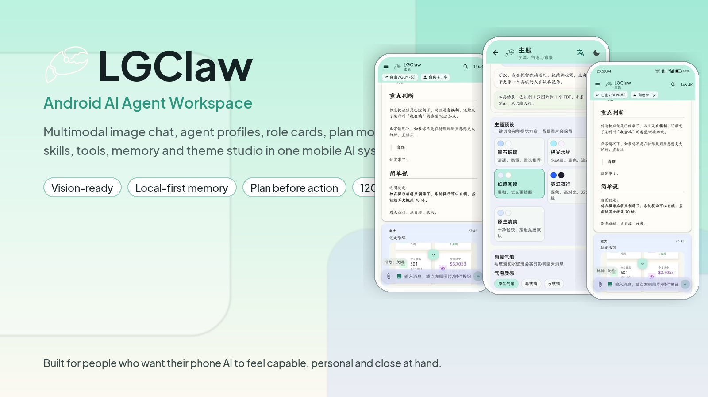
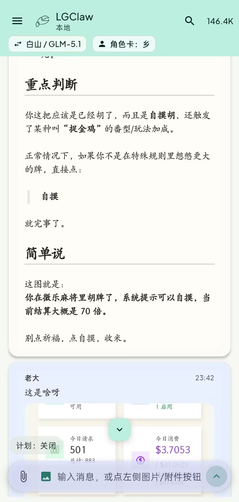
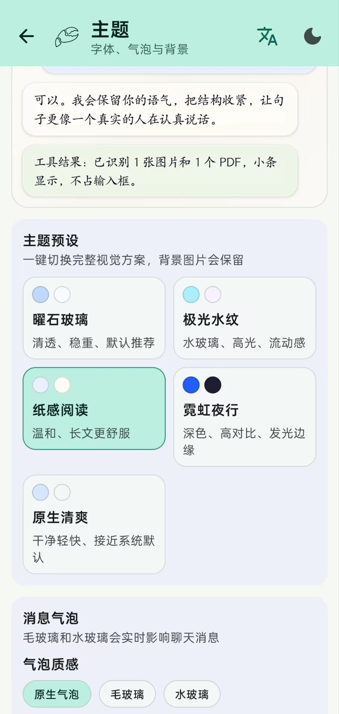
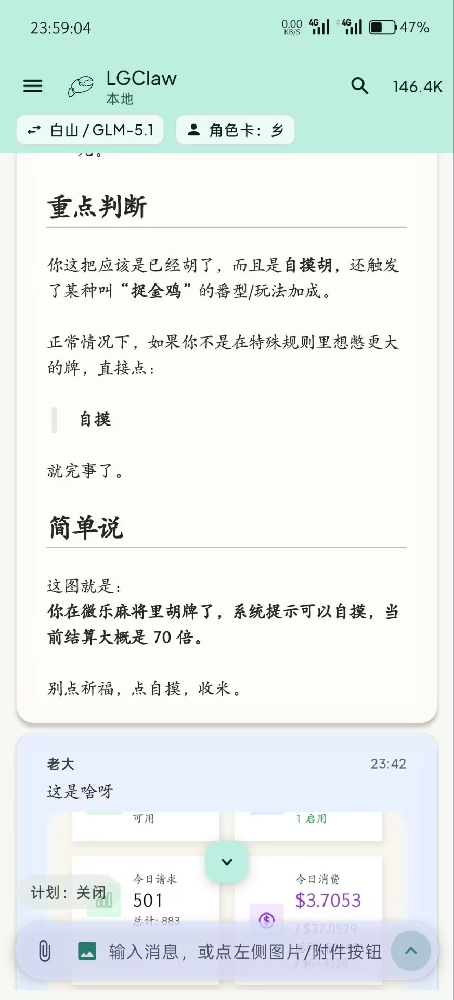

<div align="center">
  
  <h1>LGClaw</h1>
  <p><strong>A mobile AI agent workspace for Android.</strong></p>
  <p>Chat, see images, plan work, call tools, manage skills, bind agents, remember context, and shape the whole experience from your phone.</p>
</div>

<div align="center">

[](#)
[](#)
[](#)
[](./LGClaw-Pro-debug.apk)

</div>

<p align="center">
  <a href="./README.zh-CN.md">简体中文</a> ·
  <a href="./LGClaw-Pro-debug.apk">Download APK</a> ·
  <a href="https://github.com/ly5201314gjx/LgClaw/releases">Releases</a>
</p>



## Why LGClaw

Most AI apps are still just a chat box. You ask, it answers, the context fades, and the model is left alone to do everything.

LGClaw is built around a different feeling: an AI assistant that can carry memory, roles, plans, skills, tools, attachments, and model choices with it. It can draft a plan before acting. It can bind an agent profile or role card to a conversation. It can switch providers on the fly. And when the active model supports vision, uploaded images are sent as real multimodal input instead of being reduced to a filename.

It is still an Android app, but it behaves more like a pocket-sized AI control room: close, practical, extensible, and comfortable enough to use every day.

## Highlights

- **Multimodal image chat**: a dedicated image upload button sends compressed visual input to vision-capable models. Non-vision models clearly report that image understanding is unsupported.
- **Plan Mode**: quick, standard, deep, and Codex-style planning. LGClaw writes a plan first, then waits for Execute, Add Requirements, or Cancel.
- **Agent Center**: create, inspect, edit, AI-complete, test, bind, and unbind runtime agent profiles.
- **Role Cards**: define persona, tone, boundaries, and behavior. A bound role card is read on every turn.
- **Skill System**: enable or disable skills without removing them. Deletion requires long press plus confirmation.
- **Dynamic Tools**: create runtime tools and expose them to the agent loop without rebuilding the APK.
- **Memory Compression**: local long-term memory and compressed memory with sentence scoring plus gzip archival.
- **Provider Console**: configure providers, fetch model lists, equip multiple models per provider, and switch models from the chat header.
- **Search Toolkit**: DuckDuckGo, DuckDuckGo Lite, Mojeek, Wikipedia, StackExchange, and browser fallback paths.
- **Attachment Chat**: images, PDFs, Word documents, text files, and common local documents.
- **Theme Studio**: glass bubbles, water-glass styling, fonts, text size, line height, chat backgrounds, sidebar backgrounds, opacity, blur, and readability masks.
- **120Hz-friendly UI**: the Android window requests the highest supported refresh mode for smoother scrolling and animation.

## Install

The repository includes the latest debug APK:

```text
LGClaw-Pro-debug.apk
```

Download it directly from this repository or from [GitHub Releases](https://github.com/ly5201314gjx/LgClaw/releases).

> This is a debug build for testing and personal use. For public distribution, sign a release build with your own keystore.

## First Run

1. Install the APK on your Android device.
2. Open Settings and go to the provider/model console.
3. Enter your API Key and Base URL.
4. Fetch models and select the models you want to equip.
5. Return to chat and switch models from the top bar.
6. For image understanding, choose a vision-capable model such as GPT-4o, GPT-4.1, GPT-5, Gemini, Claude, Qwen-VL, GLM-4V, or a compatible multimodal model.

## Screenshots

<table>
  <tr>
    <td width="33%" align="center">
      
      <br />
      <strong>Chat and Vision</strong>
      <br />
      <sub>Images, role cards, plan mode, and model switching stay close to the conversation.</sub>
    </td>
    <td width="33%" align="center">
      
      <br />
      <strong>Theme Studio</strong>
      <br />
      <sub>Fonts, bubbles, backgrounds, and glass effects are adjustable in real time.</sub>
    </td>
    <td width="33%" align="center">
      
      <br />
      <strong>Multimodal Messages</strong>
      <br />
      <sub>Phone photos are prepared as visual input for vision-capable models.</sub>
    </td>
  </tr>
</table>

## Build From Source

Requirements:

- Android Studio
- JDK 17
- Android SDK configured through `local.properties`

Build, test, and lint:

```powershell
.\gradlew.bat assembleDebug testDebugUnitTest lintDebug --stacktrace
```

APK output:

```text
app/build/outputs/apk/debug/app-debug.apk
```

## Repository Layout

```text
LGClaw/
  app/src/main/java/com/lgclaw/
    agent/          Agent loop, context assembly, planning dispatch
    agents/         Agent profiles, role cards, session bindings
    memory/         Long-term memory and compressed memory
    providers/      OpenAI, Anthropic, Responses, and compatible providers
    skills/         Skill loading, enabling, matching, and runtime use
    tools/          Android, local files, search, web, dynamic tools
    ui/             Compose chat UI, settings, drawer, theme, panels
  app/src/main/assets/
    skills/         Bundled skills
    templates/      AGENT / USER / TOOLS / MEMORY / HEARTBEAT templates
  docs/assets/      Brand, screenshots, and documentation assets
  LGClaw-Pro-debug.apk
```

## Privacy And Safety

- LGClaw is local-first by default. App data is stored on the phone.
- Data leaves the device only when a configured model provider, channel, or tool is explicitly used.
- API keys are supplied and managed by the user inside the app.
- The agent can use only runtime-exposed tools and Android permissions granted by the user.
- Debug APKs are convenient for testing but should not replace signed production releases.

## Credits

LGClaw is inspired by PalmClaw/OpenClaw-style mobile agent workflows and extends that direction with a Chinese-first UI, runtime agents, skills, tools, memory, plan mode, role cards, multimodal chat, and a richer Android experience.

## License

See [LICENSE](./LICENSE) and [LICENSE-COMMERCIAL.md](./LICENSE-COMMERCIAL.md).
