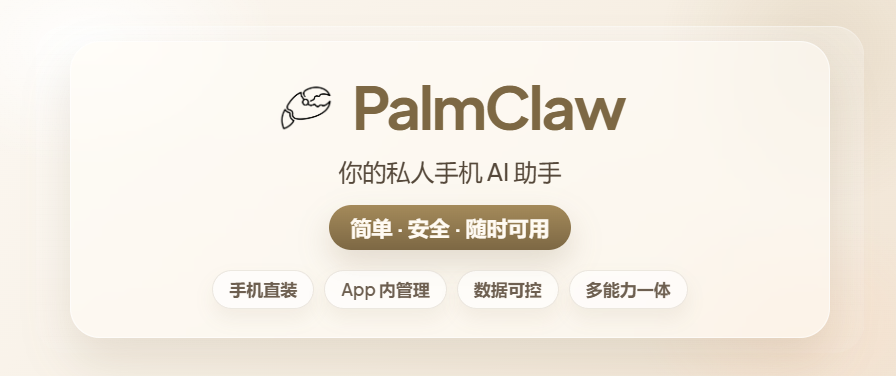
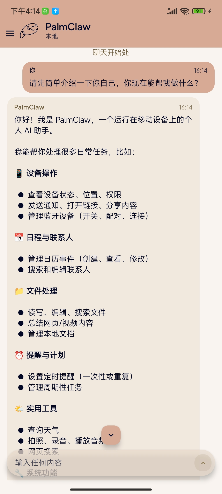
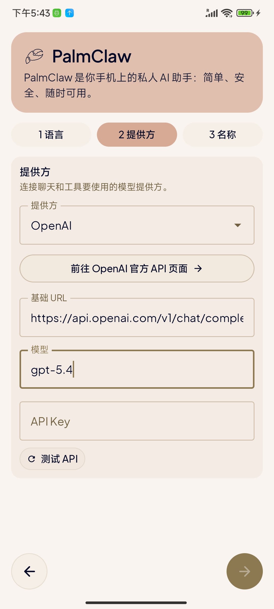
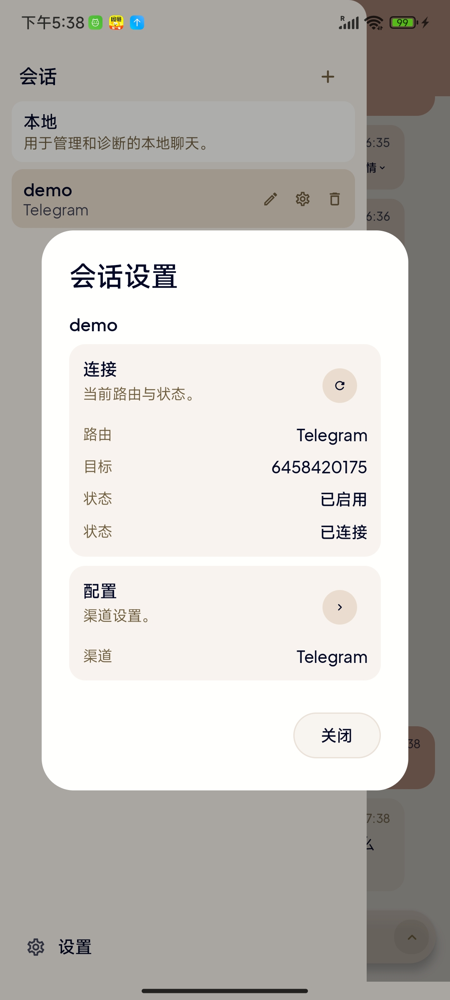

<div align="center">
  
  <h1>LGClaw</h1>
  <p><strong>把一台 Android 手机，变成可以随身携带的 AI 智能体工作台。</strong></p>
  <p>聊天、读图、计划、工具、技能、记忆、角色卡、智能体、主题和多模型切换，都收进一个更顺手的移动端 AI 系统里。</p>
</div>

<div align="center">

[](#)
[](#)
[](#)
[](./LGClaw-Pro-debug.apk)

</div>

<p align="center">
  <a href="./README.md">English</a> ·
  <a href="./LGClaw-Pro-debug.apk">直接下载 APK</a> ·
  <a href="https://github.com/ly5201314gjx/LgClaw/releases">GitHub Releases</a>
</p>



## 为什么做 LGClaw

很多 AI App 只是一个聊天框：你问，它答，然后上下文慢慢丢失，能力也停在模型本身。

LGClaw 想做的是另一件事：让手机里的 AI 不只是“回答问题”，而是能带着角色、记忆、技能和工具一起工作。它可以先为复杂任务写计划，等你确认后再执行；可以绑定智能体和角色卡，让对话有稳定的人设和工作方式；可以接入不同模型供应商，也可以在支持视觉的模型上真正读取图片内容。

它仍然是一个 Android App，但更像一个贴身的 AI 控制台：轻一点，近一点，能长期陪你处理写作、搜索、自动化、资料整理、灵感记录和移动端工作流。

## 现在能做什么

- **多模态图片对话**：对话框旁边有独立图片上传入口。使用支持视觉的模型时，图片会被压缩成模型可读取的视觉输入；非视觉模型会明确提示不支持读图。
- **计划模式**：快速计划、标准计划、深度计划、Codex 调度。先生成计划书，你可以选择执行、追加要求或取消，不会贸然开干。
- **智能体中心**：创建、查看、编辑、AI 补全、测试和绑定智能体。每个会话都可以绑定自己的 Agent Profile。
- **角色卡系统**：定义角色、人设、说话方式和边界。绑定后每轮对话都会读取角色卡，让 AI 更稳定地进入你想要的状态。
- **技能系统**：技能可以启用/停用，停用后不会消失；只有长按并二次确认才会删除。
- **动态工具系统**：在运行时创建工具，下一轮对话即可让 AI 调用，不需要重新打包 APK。
- **记忆与压缩**：本地保存长期记忆和压缩记忆，使用句子评分与 gzip 归档，让长对话更可控。
- **模型控制台**：一个供应商可装备多个模型；填写 API Key 和 Base URL 后可拉取模型并勾选；聊天顶部可快速切换。
- **搜索增强**：DuckDuckGo、简版 DuckDuckGo、Mojeek、维基百科、StackExchange 和浏览器搜索 fallback。
- **附件对话**：支持图片、PDF、Word、文本等附件。图片走视觉链路，文档走文本摘录和附件摘要链路。
- **主题工作台**：玻璃气泡、水玻璃、字体、字号、行距、聊天背景、侧边栏背景、透明度、模糊和遮罩都可以调。
- **120Hz 适配**：窗口会请求设备支持的高刷新模式，让滚动和动画更顺。

## 安装

仓库根目录已经带有当前构建好的调试安装包：

```text
LGClaw-Pro-debug.apk
```

你可以直接在 GitHub 页面点开下载，也可以到 [Releases](https://github.com/ly5201314gjx/LgClaw/releases) 获取安装包。

> 这是 debug APK，适合测试和自用。正式公开分发建议使用自己的 keystore 重新签名 release 版本。

## 使用前准备

1. 在手机上安装 APK。
2. 打开应用，进入设置里的模型供应商/模型控制台。
3. 填写 API Key、Base URL，拉取模型。
4. 勾选要装备的模型。
5. 回到聊天页，在顶部快速切换模型。
6. 如果要读图，请选择视觉模型，例如 GPT-4o、GPT-4.1、GPT-5、Gemini、Claude、Qwen-VL、GLM-4V 等。

## 项目截图

<p align="center">
  
  
  
</p>

## 从源码构建

环境要求：

- Android Studio
- JDK 17
- Android SDK
- `local.properties` 中配置本机 SDK 路径

构建、测试和 lint：

```powershell
.\gradlew.bat assembleDebug testDebugUnitTest lintDebug --stacktrace
```

APK 输出：

```text
app/build/outputs/apk/debug/app-debug.apk
```

## 仓库结构

```text
LGClaw/
  app/src/main/java/com/lgclaw/
    agent/          智能体循环、上下文组装、计划调度
    agents/         智能体 Profile、角色卡、会话绑定
    memory/         长期记忆与压缩记忆
    providers/      OpenAI、Anthropic、Responses 等供应商兼容层
    skills/         技能加载、启用、匹配与运行
    tools/          Android、本地文件、搜索、网页、动态工具
    ui/             Compose 聊天、设置、侧边栏、主题和面板
  app/src/main/assets/
    skills/         内置技能
    templates/      AGENT / USER / TOOLS / MEMORY / HEARTBEAT 模板
  docs/assets/      品牌、截图和文档资源
  LGClaw-Pro-debug.apk
```

## 隐私与安全

- 默认本地优先，应用数据保存在手机本地。
- 只有当你配置模型供应商、外部通道或显式调用工具时，相关内容才会发送到对应服务。
- API Key 由用户在应用内自行填写和保存。
- AI 只能使用运行时暴露的工具，以及你授予的 Android 权限。
- debug APK 方便测试，不建议直接作为正式生产版本分发。

## 致谢

LGClaw 延续了 PalmClaw / OpenClaw 风格的移动端智能体方向，并在中文 UI、智能体、技能、工具、记忆、计划模式、角色卡、多模态、主题系统和移动端体验上做了大量改造。

## 许可证

见 [LICENSE](./LICENSE) 和 [LICENSE-COMMERCIAL.md](./LICENSE-COMMERCIAL.md)。
